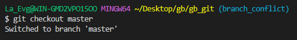
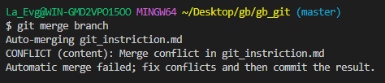
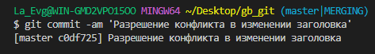

# Работа с Git

## 1. Проверка наличия установленного  Git
- В терминале выполнить команду `git version`. Если Git установлен, появится сообщение с информацией о версии программы. Иначе будет сообщение об ошибке.

## 2. Установка Git
- Загружаем последнюю версию c [официального сайта](https://git-scm.com/download/win "Скачать Git")
- Устанавливаем с настройками по умолчанию.

## 3. Настройка Git
- При первом использовании Git необходимо представитьсяю Для этого необходимо ввести в терминале две комманды:
```bash
git config --global user.name "Ваше имя"
git config --global user.email "mail@mail.com"
```

## 4. Создание репозитория
- Получить репозиторий можно двумя способами:
    1. В терминале переходим к папке, в которой хотим создать репозиторий. Выполняем комманду:
        ```bash
        git init
        ```
    2. Для получения копии существующего Git-репозитория, например, проекта, в который вы хотите внести свой вклад, необходимо использовать команду `git clone <url>`. Где `<url>` - ссылка на репозиторий.

## 5. Определение состояния файлов
- Для определения, какие файлы в каком состоянии находятся используется команда `git status`.
    - Если выполнить ее после изменений и до добавления коммита, отобразится следующее:
        
    - Если рабочий каталог чистый, и в нем нет отслеживаемых измененных файлов:
        

## 6. Отслеживание новых файлов
- Для того чтобы начать отслеживать (добавить под версионный контроль) новый файл, необходимо использовать команду `git add "/Каталог/Название файла"`.
    - Если после этого выполнить команду status, то увидите, что файл теперь отслеживаемый и добавлен в индекс:

        

## 7. Просмотр изменений
- Если результат работы команды `git status` недостаточно информативен и нужно посмотреть что конкретно поменялось - необходимо использовать команду `git diff`:
    
    > `git diff` показывает непосредственно добавленные и удалённые строки

## 8. Фиксация изменений 
- Для того, что бы зафиксировать изменения в проекте используется комманда `git commit`. Эта команда откроет текстовый редактор с предложением ввести комментарий к коммиту.
- Для быстрого добавления коммита, в одну строчку используется комманда `git commit -m "commit message"`, где `commit message` - комментарий.
    

    > Комманда c параметрами *-am* - `git commit -am "commit message"` позволяет создать коммит изменений и добавляет комментарий.

- Для того, что бы добавить изменения в последний коммит используется комманда `git commit --amend`. При передаче этого параметра будет изменен последний коммит. Вместо создания нового коммита проиндексированные изменения будут добавлены в предыдущий коммит
    

## 9. Просмотр истории коммитов
- Для возможности посмотреть что было сделано — историю коммитов используется команда `git log`.
    - По умолчанию (без аргументов) git log перечисляет коммиты, сделанные в репозитории в обратном к хронологическом порядке — последние коммиты находятся вверху.
    
    - С помощью аргументов `-p` или `--patch` можно ограничить количество записей в выводе команды и посмотреть разницу, внесенную в каждый коммит (как при применении функции `git diff`)
    
    - С помощью аргумента `--oneline` можно просмотреть историю коммитов с сокращенном виде:
    
    - Для просмотра истории записей и визуального отображения веток используется комманда `git log --graph`
    


## 10. Перемещение между коммитами

- Для перемещения между коммитами (переноса указателя HEAD) используется комманда `git checkout "sha"`. Где sha это хеш-значение коммита на который необходимо перейти.
    

-   Для возврата в актуальную версию коммита используется комманда `git checkout master`
    

## 11. Игнорирование файлов
- С помощью создания файла в корне проекта `.gitignore` можно заставить Git игнорировать определенные файлы и каталоги, то есть исключить их от отслеживания Git.

    К шаблонам в файле .gitignore применяются следующие правила:
    ```
    - Пустые строки, а также строки, начинающиеся с #, игнорируются.

    - Стандартные шаблоны являются глобальными и применяются рекурсивно для всего дерева каталогов.

    - Чтобы избежать рекурсии используйте символ слеш (/) в начале шаблона.

    - Чтобы исключить каталог добавьте слеш (/) в конец шаблона.

    - Можно инвертировать шаблон, использовав восклицательный знак (!) в качестве первого символа.
    ```
    Например игнорирование каталога `img`:
    
    Добавляем наш файл `.gitignore` в отслеживаемые файлы коммандой 
    ```bash
    git add .gitignore
    ```
    После этих действий видим, что папка и файлы в ней `img` не отслеживается Git.
    

## 12. Работа с ветками
- Комманда `git branch` – Позволяет управлять ветками. Используйте эту метку для обозначения всех вопросов, связанных с ветками, их созданием, структурой, управлением и удалением.
- При использовании комманды `git branch` в терминале можено просмотреть список действующих веток:

- Для просмотра

### Создание ветки
- Для создания новой ветки используется комманда:
    ```
    git branch <name branch>
    ```
    Где `<name branch>` это название ветки.

### Слияние веток
- Когда работа в ветке закончена её можно влить в ветку master. Для этого нужно:
    1. Закоммитить изменения в ветке коммандой `git commit -am <Описание изменения>`
    
    2. Переключиться на основную ветку коммандой `git checkout master`
    
    3. Добавить изменения из второстепенной ветки в основную коммандой `git merge <branch>`.
    Где `<branch>` - название ветки.
    

### Разрешение конфликтов
- Если разработчик A попытается изменить код, который редактирует разработчик B, может произойти конфликт. Основная задача команды `git merge` заключается в слиянии отдельных веток и разрешении любых конфликтующих правок. 

    Пример:
    - Переключимся на основную ветку master
        
    - Исправим ошибку в заголовке
        
    - Закоммитим изменения
        
    - Сольем ветку `branch` в основную ветку
        
    - Получим уведомление о конфликте
        
        Для разрешения конфликта есть 3 варианта действий:
        1. Оставить исходное изменение
        2. Оставить входящее изменение
        3. Оставить оба изменения
    - Закоммитить изменения
        

### Удаление ветки
 - Если ветка потеряла свою актуальность, можно её удалить локально при помощи команды `git branch -d <branch>`.

    
 >Важно отметить, что вы не можете удалить ветку, если вы сейчас в ней — обязательно нужно переключить её.

 ## 13. Работа с удалёнными репозиториями

 ### Копирование удаленного репозитория
- Чтобы скопировать удаленный репозиторий на свой ПК необходимо воспользоваться командой:
    ```
    git clone <адрес репозитория>
    ```
    

    Команда `git clone` составная: она не только загружает все изменения, но и сливает все ветки на локальном компьютере и в удаленном репозитории.

### Извлечение содержимого из удаленного репозитория
- Для извлечения и загрузки содержимого из удаленного репозитория и немедленного обновления локального репозитория этим содержимым существует команда:
    ```
    git pull
    ```

### Выгрузка содержимого локального репозитория в удаленный репозиторий
- Отправить свою версию репозитория во внешний репозиторий можно спомощью команды:
    ```
    git push
    ```
    >Если выгрузка происходит впервые, то необходимо будет пройти авторизацию в сервисе.